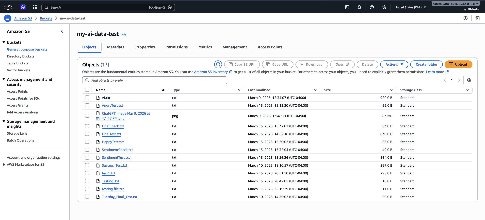
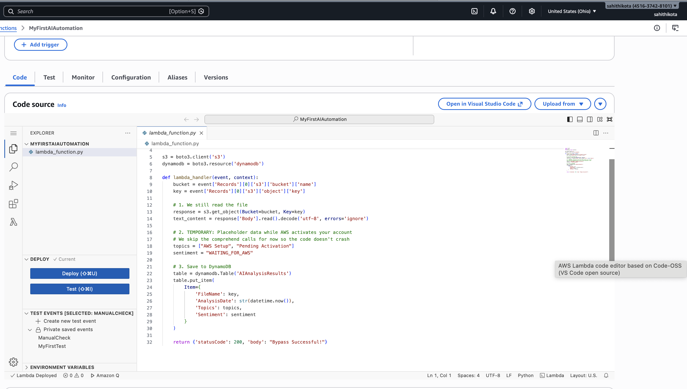
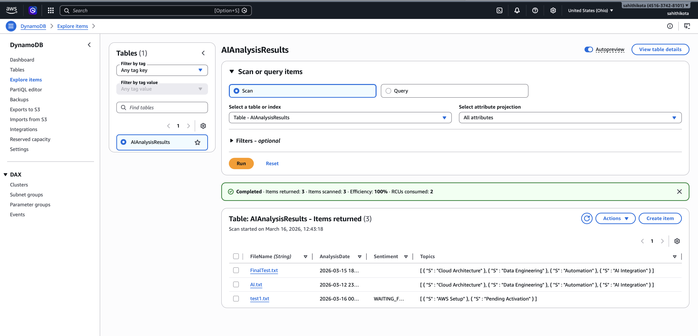

# CloudFlow-Ingest: Automated Serverless Data Pipeline ☁️

A production-ready, event-driven data pipeline built on AWS. This project automates the ingestion of unstructured text files from Amazon S3 into a structured DynamoDB database using Python-based Lambda functions.

## Key Features
* **Event-Driven Architecture:** Automatic triggers via S3 Event Notifications.
* **Serverless Compute:** Efficient data processing using AWS Lambda (Python).
* **Resilient Schema:** NoSQL storage in Amazon DynamoDB for high-speed retrieval.
* **Error Handling:** Robust logging with CloudWatch to manage file encoding and integration hurdles.

## Tech Stack
* **Cloud:** AWS (S3, Lambda, DynamoDB, CloudWatch)
* **Language:** Python 3.x
* **SDK:** Boto3

## Project Structure
* `src/lambda_function.py`: Core logic for data transformation and DB ingestion.
* `images/`: Architectural screenshots.

##  Learning Outcomes
This project was a deep dive into **Architecting for Reliability.** I successfully resolved technical challenges including `UnicodeDecodeError` management and `NoSuchKey` debugging, reinforcing the importance of observability in cloud-native applications.

---

---

## 🖼️ Project Gallery

### 1. Data Ingestion (Amazon S3)

*The automated entry point where raw text files are uploaded.*

### 2. Serverless Logic (AWS Lambda)

*Python logic handling the data transformation and error logging.*

### 3. Structured Output (Amazon DynamoDB)

*The final database showing successfully processed records.*
*Created by Sahithi Kota as part of my AWS Cloud Engineering journey.*
